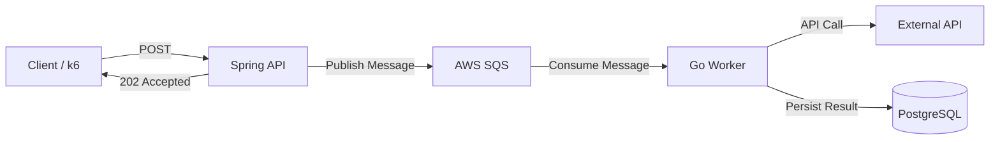

# 0001-task-event-architecture

## Status

<!--What is the status, such as proposed, accepted, rejected, deprecated, superseded, etc.? -->

proposed

## Context

<!--What is the issue that we're seeing that is motivating this decision or change? -->
기존 아키텍처는 예약 내역 분석 파이프라인을 API 요청 내에서 동기적으로 처리합니다. 예약 내역 분석 파이프라인은 장시간 실행되며 외부 LLM API를 사용합니다.

```text
API Request
    ↓
Spring API
    ↓
External LLM API (Gemini API)
    ↓
DB Persistence
    ↓
HTTP 201 CREATED
```

LLM API 응답 대기를 포함한 예약 내역 분석 작업을 처리하는 동안 API 서버 스레드가 항상 점유됩니다. API 서버 리소스를 요청 처리에 집중적으로 사용할 수 없으며 응답 지연 시간과 지속 가능한 처리량이 제한됩니다.

## Decision

- 장시간 실행되는 작업은 API 서버 내에서 처리하지 않고 별도의 Worker에서 비동기적으로 처리하는 것을 원칙으로 합니다. 이 Event-Driven 아키텍처 원칙은 앞으로 기획되는 다른 작업에 대해서도 적용됩니다.

- 예약 내역 분석 파이프라인을 Event-Driven 아키텍처로 변경합니다.



### API

* Stack: `Spring Boot` (기존과 동일)
* 작업에 필요한 정보를 메세지 브로커에 발행합니다.
* 메시지가 성공적으로 발행되면 `202 Accepted`를 반환합니다.
* API와 Worker는 독립적으로 확장할 수 있도록 분리합니다.
* 지연 시간이 큰 외부 API 호출(e.g. Gemini API)은 API 서버에서 수행하지 않습니다.

### Message Broker

* Stack: `AWS SQS`
* 일시적인 Worker 내 오류에 대응해 메세지를 복구할 수 있어야 합니다.

### 예약 내역 분석 Worker
* Stack: `Go`
* 메세지 브로커 메시지를 소비합니다.
* 기존에 API 서버에 구현된 예약 내역 분석 기능을 수행하고, 결과를 데이터베이스에 직접 저장합니다.

## Consequences

### Pros
* API 서버의 P95 지연 시간과 리소스 사용 효율이 증가합니다.
* API 서버와 장시간 실행되는 작업 worker가 독립적으로 확장되고 유지보수 됩니다.
* 장시간 실행되는 작업 장애 및 오류가 API 요청의 lifecycle과 분리됩니다.

### Cons & Solutions

* **Queue 및 Worker 관리 워크로드**
  - 구현 워크로드가 상대적으로 적은 Go / AWS SQS 프레임워크를 선택합니다.

* **Queue 및 Worker 관리 비용**
  - 동일한 throughput에서 API 서버, Worker 및 DB의 CPU/Memory 사용량을 비교하여 아키텍처 변경으로 인한 비용 trade-off를 분석합니다.