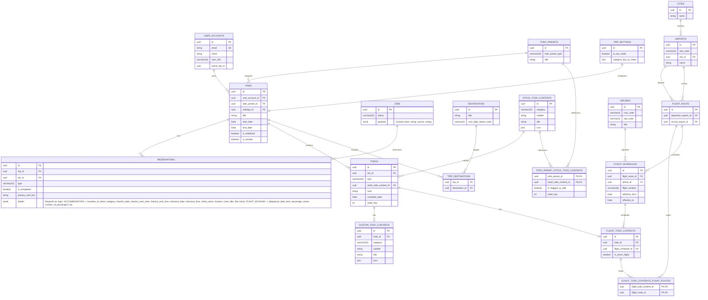

# Logical Data Model

```mermaid
erDiagram
    %% Core Entities
    USER_ACCOUNTS ||--o{ TRIPS : "owns"
    TODO_PRESETS ||--o{ TRIPS : "assigned"
    TRIP_SETTINGS ||--|| TRIPS : "configures"

    %% Trip Content
    TRIPS ||--o{ RESERVATIONS : "has"
    JOBS ||--o{ RESERVATIONS : "processes"
    TRIPS ||--o{ TODOS : "contains"
    TRIPS ||--o{ TRIP_DESTINATIONS : "includes"
    DESTINATIONS ||--o{ TRIP_DESTINATIONS : "targets"

    %% Todo Details
    STOCK_TODO_CONTENTS ||--o{ TODOS : "content"
    TODOS ||--o| CUSTOM_TODO_CONTENTS : "has"
    TODOS ||--o| FLIGHT_TODO_CONTENTS : "has"
    FLIGHT_SCHEDULES ||--o{ FLIGHT_TODO_CONTENTS : "schedules"

    %% Flight & Route Details
    FLIGHT_TODO_CONTENTS ||--o{ FLIGHT_TODO_CONTENTS_FLIGHT_ROUTES : "maps"
    FLIGHT_ROUTE ||--o{ FLIGHT_TODO_CONTENTS_FLIGHT_ROUTES : "maps"
    FLIGHT_ROUTE ||--o{ FLIGHT_SCHEDULES : "schedules"
    AIRLINES ||--o{ FLIGHT_SCHEDULES : "operates"
    AIRPORTS ||--o{ FLIGHT_ROUTE : "departs"
    AIRPORTS ||--o{ FLIGHT_ROUTE : "arrives"
    CITIES ||--o{ AIRPORTS : "contains"
    TODO_PRESETS ||--o{ TODO_PRESET_STOCK_TODO_CONTENTS : "references"
    STOCK_TODO_CONTENTS ||--o{ TODO_PRESET_STOCK_TODO_CONTENTS : "references"

    USER_ACCOUNTS {
        uuid id PK
        string email UK
        string name
        varchar(16) user_role
        uuid active_trip_id
    }

    TRIPS {
        uuid id PK
        uuid user_account_id FK
        uuid todo_preset_id FK
        uuid settings_id FK
        string title
        Date start_date
        Date end_date
        boolean is_initialized
        boolean is_sample
    }

    DESTINATIONS {
        uuid id PK
        string title
        varchar(2) iso2_digit_nation_code
    }

    TRIP_DESTINATIONS {
        uuid trip_id FK
        uuid destination_id FK
    }

    TRIP_SETTINGS {
        uuid id PK
        boolean is_trip_mode
        json category_key_to_index
    }

    RESERVATIONS {
        uuid id PK
        uuid trip_id FK
        uuid job_id FK
        varchar(32) type
        boolean is_completed
        string primary_href_link
        jsonb details "Depends on 'type': ACCOMMODATION -> {number_of_client, category, checkin_date, checkin_start_time, checkin_end_time, checkout_date, checkout_time, client_name, location, room_title, title, links}; FLIGHT_BOOKING -> {departure_date_time, passenger_name, number_of_passenger}; etc."
    }
    
    JOBS {
        uuid id PK
        varchar(32) status
        jsonb payload "Contains {text: string, source: string}"
    }

    TODOS {
        uuid id PK
        uuid trip_id FK
        varchar(16) type
        uuid stock_todo_content_id FK
        string note
        Date complete_date
        int order_key
    }

    STOCK_TODO_CONTENTS {
        uuid id PK
        varchar(32) category
        string subtitle
        string title
        json icon
    }

    CUSTOM_TODO_CONTENTS {
        uuid id PK
        uuid todo_id FK
        varchar(32) category
        string subtitle
        string title
        json icon
    }

    FLIGHT_TODO_CONTENTS {
        uuid id PK
        uuid todo_id FK
        uuid flight_schedule_id FK
        boolean is_return_flight
    }
    
    FLIGHT_TODO_CONTENTS_FLIGHT_ROUTES {
        uuid flight_todo_content_id PK, FK
        uuid flight_route_id PK, FK
    }

    TODO_PRESETS {
        uuid id PK
        varchar(32) todo_preset_type
        string title
    }

    TODO_PRESET_STOCK_TODO_CONTENTS {
        uuid todo_preset_id PK, FK
        uuid stock_todo_content_id PK, FK
        boolean is_flagged_to_add
        int order_key
    }
    
    FLIGHT_ROUTE {
        uuid id PK
        uuid departure_airport_id FK
        uuid arrival_airport_id FK
    }
    
    FLIGHT_SCHEDULES {
        uuid id PK
        uuid flight_route_id FK
        uuid airline_id FK
        varchar(16) flight_number
        Date effective_from
        Date effective_to
    }

    AIRLINES {
        uuid id PK
        varchar(4) icao_code
        varchar(3) iata_code
        string title
    }

    AIRPORTS {
        uuid id PK
        varchar(3) iata_code
        uuid city_id FK
        string name
    }
    
    CITIES {
        uuid id PK
        string name    
    }
```